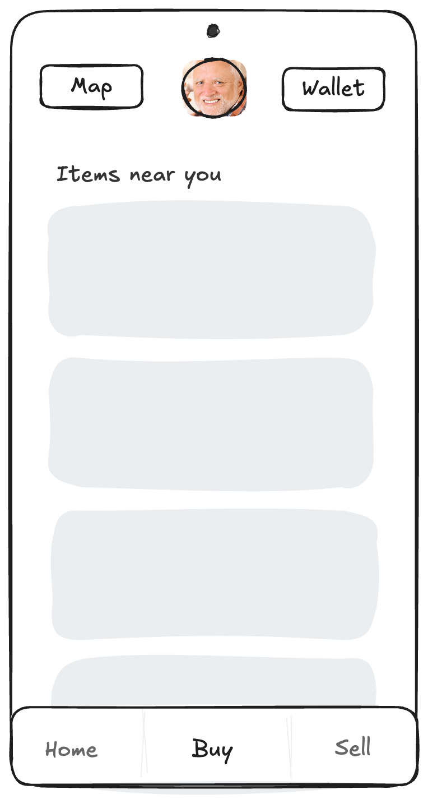

# Tech Assessment

This assessment is designed to evaluate your approach to technical documentation, architecture planning, CI/CD, and Infrastructure as Code (IaC) strategies, as well as basic Flutter navigation implementation. Below, you’ll find the requirements, user stories, and submission guidelines.

---

## Overview

In this assessment, you are provided with:
1. A **UI wireframe** (`ui_wireframe_design.png`) that illustrates the primary screens and navigation elements of our application (Home, Buy, Sell, Map, Wallet).
2. A **stub Flutter app** that you will extend with basic navigation features.
3. A requirement to produce an **architecture diagram** that addresses our backend design and scalability considerations.

**Important**: You do not need to implement any actual backend code or complex logic for this assessment. Instead, you will:
- Implement **basic navigation** within the Flutter app based on the wireframe.
- Create an **architecture diagram** and **design documentation** that explains how the backend and infrastructure would be structured to handle the user stories below.

---

## User Stories

Below are **five user stories** derived from the wireframe. These will guide your architecture and design decisions:

1. **Browse Nearby Items**  
   *“As a user, I want to see items for sale near my location so that I can easily find local goods.”*  
   - Users open the app and view a list of items in their vicinity.  
   - They can interact with a **Map** feature to see item locations.

2. **List an Item for Sale**  
   *“As a user, I want to list an item for sale so that I can make it available for purchase by others.”*  
   - Users navigate to the **Sell** section and create a new listing with details (title, price, location, etc.).

3. **View Map of Items**  
   *“As a user, I want to view a map with pins of items for sale so that I can quickly locate items around me.”*  
   - Users tap the **Map** button to see a map view with item locations.  
   - Tapping on a pin might show a popup with item details (this does not need to be fully implemented, but should be considered in the architecture).

4. **Manage Wallet**  
   *“As a user, I want to view and manage my wallet so that I can see my balance and past transactions.”*  
   - Users navigate to the **Wallet** section to check their balance and transaction history.  
   - The app should be prepared to handle transaction events (e.g., adding funds, making a purchase).

5. **Complete a Transaction**  
   *“As a user, I want to purchase an item from a seller and finalize the transaction within the app.”*  
   - Users buy items directly from a listing or from the map.  
   - The system must handle transaction events, update the wallet balance, and record the purchase.

---

## Task Breakdown

### 1. Flutter Navigation Implementation
- **Objective:** Set up navigation in the provided Flutter stub app so that users can move between the main screens:
  - **Home/Buy** (default screen showing “Items near you”)
  - **Sell**
  - **Map**
  - **Wallet**
- **Requirements:** 
  - Implement a bottom navigation bar (as shown in the wireframe) for switching between Home (Buy), Sell, and any other primary screens.
  - Include a top navigation element or button for the Map and Wallet as indicated by the wireframe.
  - Create basic placeholders for each screen (no need to implement backend calls or detailed UI).

### 2. Architecture Diagram & Design Documentation
- **Objective:** Provide a high-level diagram and accompanying documentation that illustrates how the system would handle:
  1. **Scalability** to 10,000 simultaneous users.
  2. **Backend Services** on Azure (or a similar platform) for handling CRUD operations, item listings, and user transactions.
  3. **Firebase** for user authentication and push notifications.
  4. **Transaction Events** (e.g., purchases, wallet updates).
  5. **CI/CD Pipeline** (optional high-level overview) for automated testing and deployment.
  6. **IaC Plan** for provisioning and managing your backend services (you only need to describe how you would do this, without actual paid deployment).

- **Format:**
  - You may use any diagramming tool (e.g., draw.io, Lucidchart).
  - Save your diagram as an image (PNG/JPEG) and include it in the repository (e.g., `/docs/architecture_diagram.png`).
  - Write a document (`architecture_design.md`) in the `/docs` folder that explains each component and its role in the overall system.

### 3. CI/CD & IaC Planning (Optional for Extra Detail)
- Although no actual paid service deployment is required, please outline:
  - **CI/CD Pipeline:** A brief explanation of how you would automate testing and deployment for both the frontend and backend.
  - **Infrastructure as Code:** A conceptual plan using tools like Terraform or ARM templates to provision resources (compute, database, storage, etc.) in production.
  - **Scalability Considerations:** How you would handle horizontal and vertical scaling for up to 10,000 simultaneous users.

---

## Submission Instructions

1. **Repository:** Fork this repository and push your changes to a new branch.
2. **Flutter App:** Implement the navigation changes in the `/flutter_app` directory.
3. **Documentation:** Place your architecture diagram image (`architecture_diagram.png`) and design document (`architecture_design.md`) in the `/docs` folder.
4. **Pull Request:** Submit a pull request (or share the repository link) with your branch, including a summary of your approach and any assumptions made.
5. **Deadline:** Please submit your assessment within the agreed-upon timeline.

---

## Evaluation Criteria

Your submission will be evaluated on the following:
1. **Flutter Implementation:** Clarity and correctness of the Flutter navigation.
2. **Architecture Diagram:** How well your diagram addresses the user stories, transaction handling, and scalability.
3. **Documentation Quality:** Thoroughness and clarity of the design document (including your CI/CD, IaC plans, and handling of transaction events).
4. **Communication:** Clear presentation of assumptions, decisions, and overall approach.

**Note:** Nothing has to be perfect, and it is acceptable to cut corners. However, please document areas where you know you could have improved the implementation or planning. Our goal is to understand your way of working and your ability to independently implement various parts of the app and planning.

---

## Additional Notes

- **Communication:** If you have any questions or need clarification during the assessment, please reach out.
- **Assumptions:** Document any assumptions that deviate from the provided instructions.

Good luck, and we look forward to reviewing your work!